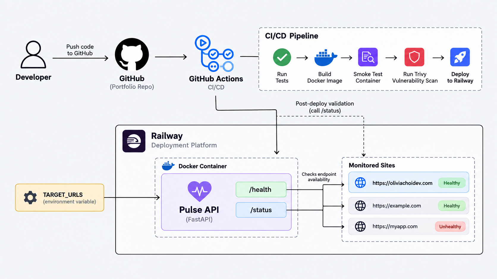

# pulse

A lightweight containerized health-check service for validating live web deployments.

Pulse monitors configured web endpoints and reports whether they are healthy. It is packaged as a Docker container, deployed on Railway, and integrated with GitHub Actions for automated testing, runtime validation, vulnerability scanning, and post-deployment checks.

## Tech Stack

- Python
- FastAPI
- Docker
- GitHub Actions
- Trivy
- Railway

## Architecture



## What It Does

Project Pulse exposes two main endpoints:

- `/health` confirms that the Pulse service itself is running.
- `/status` checks configured target URLs and reports their availability.

Target URLs are provided through the `TARGET_URLS` environment variable, allowing the same container image to be reused across different environments without modifying application code.

Example response:

```json
{
  "status": "healthy",
  "services": [
    {
      "url": "https://oliviachoidev.com",
      "status": "up",
      "status_code": 200
    }
  ]
}
```
